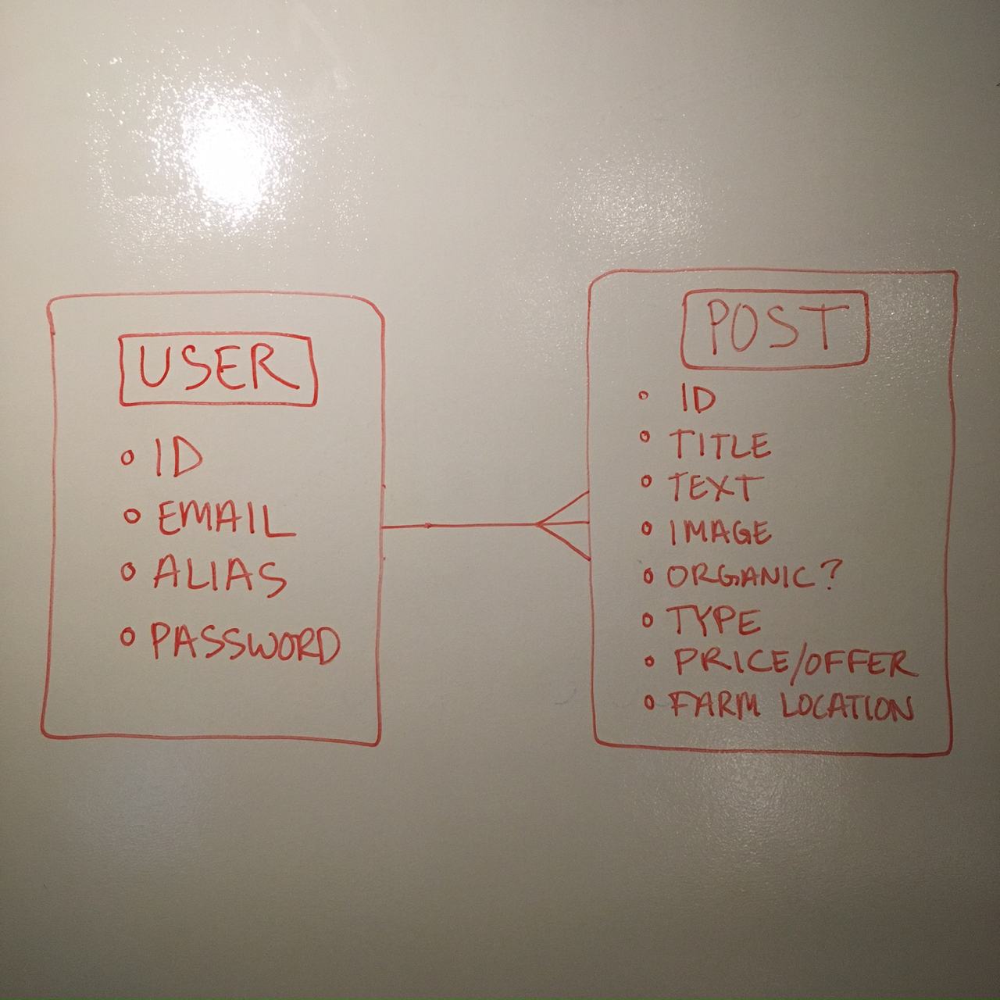

#FARMERSLIST

##INTRODUCTION

Do you know where your food comes from?

**farmerslist®** connects farmers with customers who want to learn more about their local food supply.

We encourage everyone to get out and visit the places where food is produced and interact with the good folks growing it.

Your community can use **farmerslist®** to find out what's available, when, where, and for how much. The rest is up to you.

Just remember, everything is negotiable, so haggle away!

##TECH USED

*Ruby on Rails

*HTML/CSS

*Bootstrap

*Postgresql

##APPROACH

I created two models--one for Users and one for Posts--that contain all of the information necessary to liaise between farmers and consumers. These models manage my data and databases.

##TRELLO PAGE

[Click here for work flow](https://trello.com/b/oO3KZeB3/wdi-project-2-farmerslist)

##UNSOLVED PROBLEMS

I would like to eventually include functionality for a relayed email system similar to the one in place on craigslist.

##INSTALLATION INSTRUCTIONS

Click on [this link](https://github.com/tomasfaustin/project2_farmerslist) to navigate to my Github repository.

In the top right corner there's a green button that reads "Clone or download." Click on "Download ZIP."

Run the downloaded zip file and navigate to the resulting folder in Terminal. If you downloaded the file to your "Download" folder, the terminal command will most likely be 'cd Downloads/project2_farmerslist/'.

Run the following commands in Terminal:

*bundle install (installs gems)

*rake db:create (creates database)

*rake db:migrate (creates all models)

*rake db:seed (data for creating database entries)

*rails s (launches server)

*Open Chrome and navigate to 'localhost:3000' which will take you to the login portal for the site.

##MVP

A Fully Functional CRUD Application that allows users to create an account, add posts to the public forum, and remove or revise their posts from the forum.

##WIREFRAMES

